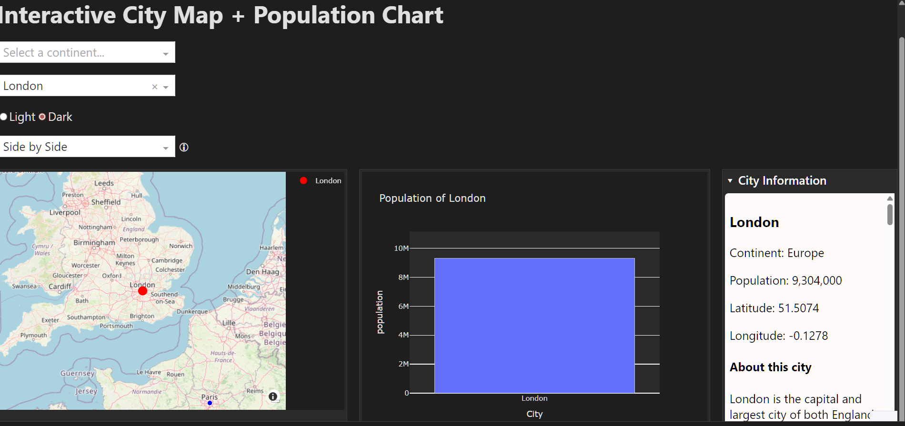

<p align="center">
  <strong>🌍 Interactive City Dashboard</strong><br>
  <em>Explore world cities with an interactive map, charts, and live data</em>
</p>

<p align="center">

  <!-- Python version -->
  

  <!-- License -->
  

  <!-- Repo size -->
  

  <!-- Last commit -->
  

  <!-- Stars -->
  

</p>

# Interactive City Map + Population Dashboard

- A fully interactive Dash application that visualises world cities with:
- A dynamic Mapbox map
- A responsive population bar chart
- A collapsible Wikipedia-powered city information panel
- A clean light/dark theme system
- Multiple layout modes (side-by-side, stacked, wide, minimalist, pro)
- A modular, test-driven architecture designed for clarity and maintainability

This project demonstrates professional-grade Dash engineering, clean separation of concerns, and a fully tested callback + layout system.

---

## Features

### Interactive Map
- Click any city to update the dashboard
- Map auto-centres and highlights the selected city
- Built using Plotly Mapbox

### Population Chart
- Shows population for the selected city
- Automatically scales the y-axis
- Theme-aware styling

### Wikipedia Summary Panel
- Collapsible “City Information” panel
- Fetches live summaries via a service layer
- Clean separation between UI and data fetching

### Light/Dark Themes
- Full theme propagation across map, chart, and layout
- Smooth transitions

### Multiple Layout Modes
- Side-by-side
- Stacked
- Sidebar
- Wide map focus
- Chart focus
- Minimalist
- Three-column “Pro” layout

### Testing
- Layout tests
- Callback unit tests
- Integration tests using Dash’s callback map

---

## Demo

### 🎥 Video Preview
Click below to watch the 1 minute demo:

[▶️ View Demo Video](Demo.mp4)

---

## Screenshots

### Dashboard (Light Mode)


### Dashboard (Dark Mode)


### City Views


---

## Project Structure

```text
project_flask_api/
│
├── api.py                     # Dash app entrypoint
│
├── data/
│   └── populations.py         # City dataset
│
├── services/
│   └── wiki.py                # Wikipedia summary fetcher
│
├── components/
│   ├── map_builder.py         # Map figure builder
│   ├── charts.py              # Population chart builder
│   ├── details_panel.py       # Wiki/details panel builder
│   └── theme.py               # Light/Dark theme definitions
│
├── layout/
│   └── layout.py              # serve_layout() → full UI tree
│
├── callbacks/
│   └── callbacks.py           # Pure callback logic + register_callbacks()
│
└── tests/
    ├── test_layout.py
    ├── test_callbacks.py
    └── test_integration_app.py
```
## Installation

```bash
git clone https://github.com/reory/Interactive-City-Dashboard.git
cd Interactive-City-Dashboard
pip install -r requirements.txt
```

## Running the App

```bash
python api.py
```
Then open:
http://127.0.0.1:8050

## Running Tests

```bash
pytest -q
```
- The suite includes:

- Layout structure validation

- Callback logic tests

- Integration tests using Dash’s callback registry

## Architecture Principles
This project follows:

Pure functions
- All callback logic is pure and testable.

Separation of concerns
- Layout = static UI

- Callbacks = behaviour

- Components = reusable UI builders

- Services = external data

- Data = static datasets

Predictable state
- No hidden globals, no side effects.

Test-driven structure
- Every major part of the app is validated.

## Deployment
This app can be deployed to:

- Heroku
- Render
- Azure App Service
- Docker
- Gunicorn + Nginx
- Expose the server object in api.py:

```python
server = app.server
```

## Contributing
Pull requests are welcome.
For major changes, open an issue first to discuss what you’d like to change.

## License
MIT License — free to use, modify, and distribute.